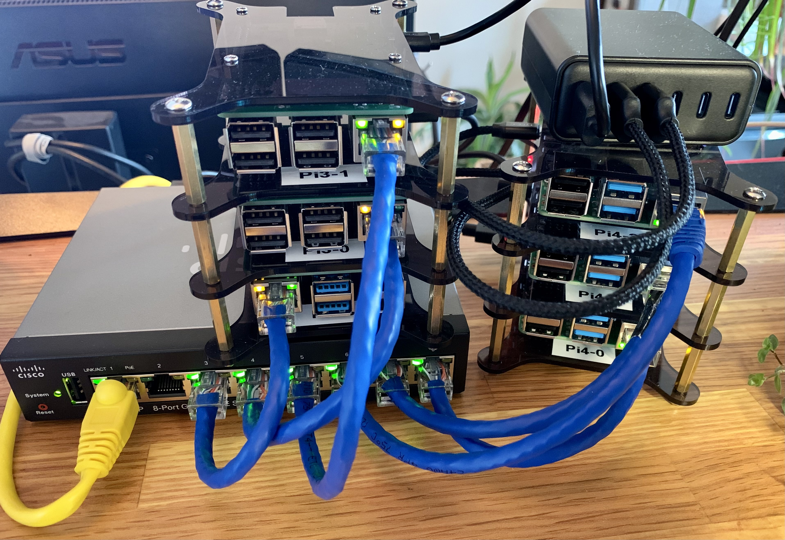

# pi_k8s
Bare metal kubernetes cluster on Raspberry PIs



## Overview

| Name | Role | Model | Memory |
| ----------- | ----------- | ----------- | ----------- |
| Pi4-0 | worker0 | Pi 4 Model B Rev 1.4 | 8GB |
| Pi4-1 | controller0 | Pi 4 Model B Rev 1.4 | 4GB |
| Pi4-2 | controller1 | Pi 4 Model B Rev 1.4 | 4GB |
| Pi4-3 | controller2 | Pi 4 Model B Rev 1.4 | 4GB |
| Pi4-4 | worker1 | Pi 4 Model B Rev 1.4 | 4GB |
| Pi4-5 | worker2 | Pi 4 Model B Rev 1.4 | 4GB |

## Pre-reqs

```bash
make ansible
```

## Installation

```bash
make install
```

## Tear down

```bash
make nuke
```
