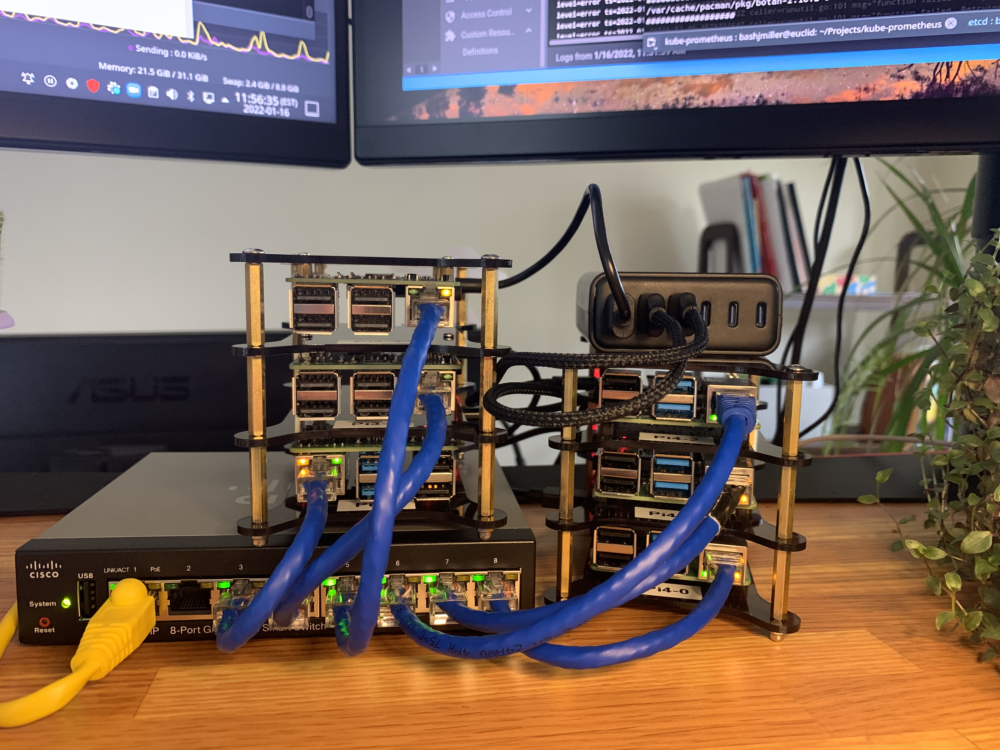

# pi_k8s
Bare metal kubernetes cluster on Raspberry PIs

## Overview

| Name | Role | Model | Memory |
| ----------- | ----------- | ----------- | ----------- |
| Pi4-1 | controller0 | Pi 4 Model B Rev 1.4 | 4GB |
| Pi4-2 | controller1 | Pi 4 Model B Rev 1.4 | 4GB |
| Pi4-3 | controller2 | Pi 4 Model B Rev 1.4 | 4GB |
| Pi4-0 | worker0 | Pi 4 Model B Rev 1.4 | 8GB |
| Pi3-0 | worker1 | Pi 3 Model B Plus Rev 1.3 (DT) | 1GB |
| Pi3-1 | worker2 | Pi 3 Model B Rev 1.2 (DT) | 1GB |

## Installation

I installed Ubuntu 21.10 64bit on each of the Pis and ran [these commands](INSTALL.md) to bootstrap the cluster.
